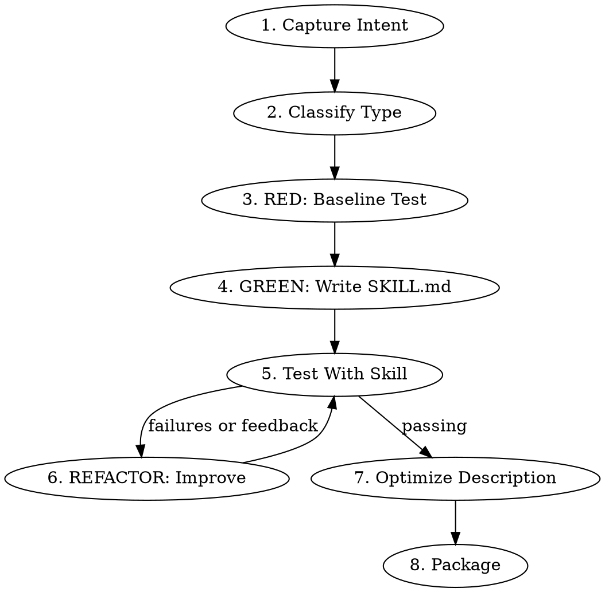
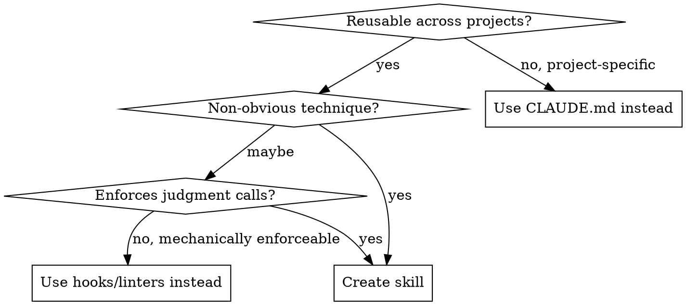

# Skill Creator

Test-driven skill creation. You write pressure scenarios first, watch agents fail without the skill, write the skill to fix those failures, then iterate until bulletproof.

**Core principle:** If you didn't watch an agent fail without the skill, you don't know if the skill teaches the right thing.

## Core Loop (RED-GREEN-REFACTOR)



---

## Phase 1: Capture Intent

### Should This Be a Skill?



**Don't create skills for:** one-off solutions, standard well-documented practices, project-specific conventions (CLAUDE.md), or rules enforceable by automation.

### Interview

The conversation might already contain a workflow to capture (e.g., "turn this into a skill"). If so, extract answers from history first — tools used, sequence of steps, corrections made, formats observed. The user fills gaps and confirms.

Questions to answer:
1. What should this skill enable Claude to do?
2. When should it trigger? (user phrases, contexts, symptoms)
3. What's the expected output format?
4. What goes wrong without the skill? (this becomes your baseline test hypothesis)

---

## Phase 2: Classify Skill Type

Different types need different testing and writing strategies. Classify before proceeding:

| Type | Examples | Test Strategy | Writing Focus |
|------|----------|---------------|---------------|
| **Discipline** | TDD, verification, code review | Pressure scenarios — time, sunk cost, exhaustion. Does the agent comply under stress? | Rationalization tables, red flags, loophole closure |
| **Technique** | Data transforms, debugging methods | Application scenarios — can the agent apply it to new cases? Edge cases? | Step-by-step with examples, common mistakes |
| **Pattern** | Mental models, design principles | Recognition — does it know when to apply AND when not to? | When-to-use flowchart, counter-examples |
| **Reference** | API docs, command guides, tool docs | Retrieval — can the agent find and correctly use the information? | Quick-reference tables, progressive disclosure |

---

## Phase 3: RED — Baseline Test

**Before writing any skill content, test what agents do without it.**

### Step 1: Write test cases

Create 2-3 realistic prompts — the kind of thing a real user would say. For discipline skills, add pressure: time constraints, sunk cost, authority ("just skip testing"). Share with user for confirmation.

Save to `evals/evals.json`:
```json
{
  "skill_name": "example-skill",
  "evals": [
    {
      "id": 1,
      "prompt": "User's task prompt",
      "expected_output": "Description of expected result",
      "files": []
    }
  ]
}
```

### Step 2: Run baseline

Spawn subagents WITHOUT the skill. For each test case:
```
Execute this task:
- Task: <eval prompt>
- Input files: <eval files if any, or "none">
- Save outputs to: <workspace>/iteration-0/eval-<ID>/without_skill/outputs/
```

Save results in `<skill-name>-workspace/` as a sibling to the skill directory.

### Step 3: Document failures

Record verbatim what went wrong:
- What choices did the agent make?
- What rationalizations did it use? (exact quotes)
- Which pressures triggered violations? (discipline skills)
- What information was missing or misapplied? (reference/technique skills)

This is your test failing. These specific failures are what your skill must fix.

---

## Phase 4: GREEN — Write the SKILL.md

Now write the skill that addresses the specific failures you observed.

### Frontmatter

```yaml
---
name: skill-identifier
description: Use when [specific triggering conditions, symptoms, and contexts]. Never summarize the skill's workflow here — just describe WHEN it should activate.
---
```

**Description rules (CSO — Claude Search Optimization):**
- Start with "Use when..." — triggering conditions only
- Never summarize the skill's process or workflow (Claude will follow the description shortcut instead of reading the full body)
- Include symptoms, error messages, user phrases that should trigger it
- Write in third person, under 500 characters
- Be slightly "pushy" — Claude tends to undertrigger

```yaml
# BAD: summarizes workflow — Claude follows this instead of reading skill body
description: Create skills through a TDD cycle of baseline testing, writing, and iterating

# GOOD: triggering conditions only
description: Use when creating, improving, testing, or packaging skills for Claude agents
```

### Directory Structure

```
skill-name/
  SKILL.md (required)
  scripts/     - Executable code (runs without loading into context)
  references/  - Docs loaded as needed
  assets/      - Templates, icons, fonts
```

### Token Efficiency

Every token in a skill costs context budget across every conversation that loads it.

**Targets:** <150 words for frequently-loaded skills, <500 words for others. Under 500 lines for SKILL.md.

**Techniques:**
- Move heavy reference (100+ lines) to separate files with table of contents
- Reference `--help` instead of documenting all flags inline
- Cross-reference other skills instead of repeating their content: `**REQUIRED BACKGROUND:** superpowers:test-driven-development`
- One excellent example beats three mediocre ones
- Compress examples — minimal words, maximum clarity

**Cross-referencing other skills:**
- Use `**REQUIRED BACKGROUND:** skill-name` or `**REQUIRED SUB-SKILL:** skill-name`
- Never use `@` syntax — it force-loads files, burning context before needed

### Writing Patterns

- Use imperative form
- Explain the **why** — LLMs respond better to reasoning than rigid MUSTs
- If writing ALWAYS/NEVER in caps, reframe with reasoning instead
- Keep general — don't overfit to your test examples
- Write a draft, then revisit with fresh eyes

### Skill-Type-Specific Writing

**Discipline skills** — must resist rationalization:

1. **Close every loophole explicitly.** Don't just state the rule — forbid specific workarounds:
   ```
   Write code before test? Delete it. Start over.
   No exceptions:
   - Don't keep it as "reference"
   - Don't "adapt" it while running tests
   - Delete means delete
   ```

2. **Build a rationalization table** from your baseline failures (Phase 3):
   ```
   | Excuse | Reality |
   |--------|---------|
   | "Too simple to test" | Simple code breaks. Test takes 30 seconds. |
   | "I'll test after" | Tests-after prove nothing about intent. |
   ```

3. **Create a red flags list** for self-checking:
   ```
   ## Red Flags — STOP and Reconsider
   - "This is different because..."
   - "I already tested it manually"
   - "It's about the spirit, not the letter"
   All of these mean: you're rationalizing. Follow the process.
   ```

4. **Add the foundational cut-off:** "Violating the letter of the rules is violating the spirit of the rules."

**Technique skills** — step-by-step with common mistakes section.

**Pattern skills** — when-to-use flowchart + explicit counter-examples for when NOT to use.

**Reference skills** — quick-reference table first, details below, TOC for files over 300 lines.

---

## Phase 5: Test With Skill

### Step 1: Spawn all runs in parallel

For each test case, spawn two subagents simultaneously:

**With-skill run:**
```
Execute this task:
- Skill path: <path-to-skill>
- Task: <eval prompt>
- Input files: <eval files if any, or "none">
- Save outputs to: <workspace>/iteration-<N>/eval-<ID>/with_skill/outputs/
```

**Baseline run:**
- New skill: same prompt, no skill, save to `without_skill/outputs/`
- Improving existing: snapshot old version with `cp -r`, point baseline at snapshot, save to `old_skill/outputs/`

Write `eval_metadata.json` for each test case.

### Step 2: Draft assertions while runs execute

Don't wait. Draft quantitative assertions with descriptive names. Subjective skills rely more on qualitative review.

Update `eval_metadata.json` and `evals/evals.json` with assertions.

**Assertion types:**
- `file_exists` — target file exists in outputs/
- `contains` — target file contains expected string
- `count` — target file/array has expected number of items
- `custom` — free-form, evaluated by grader against natural language description

### Step 3: Capture timing data

When subagents complete, save `total_tokens` and `duration_ms` to `timing.json` immediately — only chance to capture this.

### Step 4: Grade and aggregate

1. **Grade each run** against assertions. Save to `grading.json`. For programmatically checkable assertions, write and run a script. Use fields `text`, `passed`, `evidence`.

2. **Aggregate** into `benchmark.json` and `benchmark.md` — pass_rate, time, tokens per configuration with mean +/- stddev and delta.

3. **Analyst pass** — surface hidden patterns:
   - Non-discriminating assertions (pass 100% both configs)
   - High-variance evals (flaky)
   - Time/token tradeoffs (is quality worth the cost?)
   - Regression patterns (fix for one broke another = overfitting)
   - Assertion quality (pass but output bad, or fail but output fine)

4. **Present results to user** — qualitative outputs AND quantitative benchmarks. Get results in front of the human before evaluating yourself.

### Step 5: Blind comparison (optional)

When quantitative assertions aren't enough, or you need rigorous A/B between skill versions: give two outputs to an independent agent without revealing which is which. The agent evaluates across dimensions (correctness, completeness, quality, efficiency), declares a winner with confidence level.

Use when: skill changes are subtle, user can't easily tell which output is better, or you need to break ties.

### Step 6: Read feedback

Empty feedback = looks good. Focus improvements on test cases with specific complaints.

---

## Phase 6: REFACTOR — Improve the Skill

### Principles

1. **Generalize from feedback.** You're iterating on a few examples because it's fast. Don't overfit — make changes that generalize across the skill's full usage surface.

2. **Keep the prompt lean.** Remove what isn't pulling weight. If transcripts show wasted steps, cut them.

3. **Explain the why.** If the user wrote frustrated feedback, encode the understanding behind it, not a mechanical patch.

4. **Look for repeated work.** If all test runs wrote similar helper scripts, bundle them in `scripts/`.

5. **Close new loopholes** (discipline skills). Every new rationalization from testing goes into the rationalization table and red flags list.

### Iteration Loop

1. Apply improvements
2. Rerun all test cases into `iteration-<N+1>/`
3. Present results alongside previous iteration for comparison
4. Wait for user review
5. Read feedback, improve, repeat

Stop when: user is happy, feedback is empty, or improvements plateau.

---

## Phase 7: Description Optimization

After the skill is finalized, offer to optimize the trigger description.

### Step 1: Generate 20 trigger eval queries

Mix of should-trigger (8-10) and should-not-trigger (8-10). Queries must be realistic and detailed — include file paths, personal context, company names. For should-not-trigger, focus on near-misses sharing keywords but needing something different.

### Step 2: Review with user

Present eval set. User can edit queries, toggle should-trigger, add/remove entries.

### Step 3: Optimize

Split 60% train / 40% test. Evaluate current description (3 runs per query for reliability). Iterate up to 5 times, selecting best by test score (not train) to avoid overfitting.

### Step 4: Apply

Update SKILL.md frontmatter. Show before/after and report scores.

---

## Phase 8: Package

Package the skill directory into a `.skill` zip file. Direct user to the resulting file.

---

## Updating Existing Skills

- Preserve the original `name` in directory and frontmatter
- Copy to writeable location if installed path is read-only
- Snapshot the original version first — it's your baseline
- Same RED-GREEN-REFACTOR cycle: baseline with old skill, test with new skill

---

## Checklist

Use TodoWrite to track each item:

**RED Phase:**
- [ ] Classify skill type (discipline / technique / pattern / reference)
- [ ] Create 2-3 test cases (add pressure scenarios for discipline skills)
- [ ] Run baseline WITHOUT skill — document failures verbatim
- [ ] Identify patterns in failures and rationalizations

**GREEN Phase:**
- [ ] Name: letters, numbers, hyphens only
- [ ] Description: starts with "Use when...", no workflow summary, under 500 chars
- [ ] Skill body addresses specific baseline failures
- [ ] Token-efficient: under 500 lines, heavy reference in separate files
- [ ] Discipline skills: rationalization table + red flags + loophole closure
- [ ] Run WITH skill — verify agents now comply

**REFACTOR Phase:**
- [ ] Identify new rationalizations or failure modes from testing
- [ ] Add counters and close loopholes
- [ ] Re-test until passing
- [ ] Iterate with user feedback until satisfied

**Optimize & Ship:**
- [ ] Run description optimization (Phase 7)
- [ ] Package `.skill` file
- [ ] Commit and push

---

## Grader Instructions

For each assertion:
1. Read relevant output files
2. Determine if assertion is met — be strict but fair
3. Provide specific evidence (quote output or describe findings)
4. For programmatically checkable assertions, write and run a script

Save to `grading.json` with fields: `eval_id`, `eval_name`, `expectations` (array of `{text, passed, evidence}`), `overall_pass`, `notes`. Overall pass = true only if ALL assertions pass.

---

## JSON Schemas Reference

### evals.json
```json
{
  "skill_name": "my-skill",
  "evals": [
    {
      "id": 1, "prompt": "Task prompt", "expected_output": "Expected result",
      "files": ["input.csv"],
      "assertions": [
        {"name": "descriptive-name", "type": "file_exists | contains | count | custom", "target": "output.csv", "expected": "value"}
      ]
    }
  ]
}
```

### eval_metadata.json
```json
{"eval_id": 0, "eval_name": "descriptive-name", "prompt": "Task prompt", "assertions": [{"name": "has-columns", "type": "custom", "expected": "CSV has columns: name, email, score"}]}
```

### timing.json
```json
{"total_tokens": 84852, "duration_ms": 23332, "total_duration_seconds": 23.3}
```

### benchmark.json
```json
{
  "skill_name": "my-skill", "iteration": 1, "timestamp": "2026-03-07T10:00:00Z",
  "configurations": [
    {"name": "with_skill", "label": "With Skill", "evals": [{"eval_id": 0, "eval_name": "name", "pass_rate": 1.0, "assertions": [{"text": "...", "passed": true, "evidence": "..."}], "timing": {"total_tokens": 84852, "duration_ms": 23332}}], "aggregate": {"pass_rate": {"mean": 0.85, "stddev": 0.12}, "tokens": {"mean": 75000, "stddev": 8000}, "duration_ms": {"mean": 20000, "stddev": 3000}}},
    {"name": "without_skill", "label": "Baseline", "evals": [], "aggregate": {}}
  ],
  "delta": {"pass_rate": "+15%", "tokens": "+12%", "duration": "+8%"}
}
```

### feedback.json
```json
{"reviews": [{"run_id": "eval-0-with_skill", "feedback": "missing axis labels", "timestamp": "..."}], "status": "complete"}
```

### trigger_eval.json
```json
[{"query": "Realistic user prompt", "should_trigger": true}, {"query": "Near-miss prompt", "should_trigger": false}]
```
